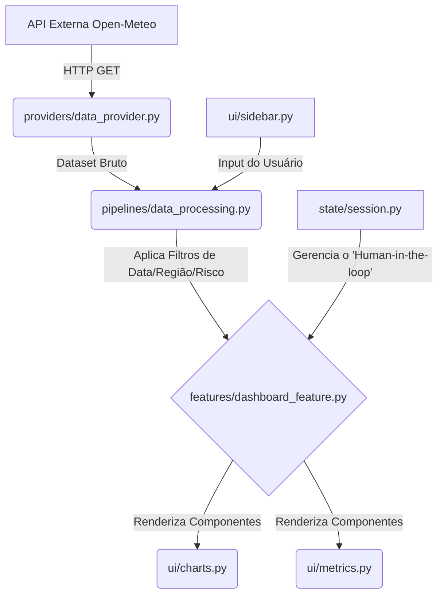

# Monitor Espacial GS 2026 - Dashboard de Inteligência Climática 🛰️

Repositório da disciplina de Front-End e Mobile Development em Sistemas de IA (Global Solution 2026.1).

## 🌍 Descrição do Problema
Com o avanço dos eventos climáticos extremos (secas prolongadas e focos de calor/queimadas), gestores ambientais e do agronegócio enfrentam o desafio de cruzar volumes massivos de dados espaciais para tomadas de decisão ágeis. Um modelo matemático ou de IA isolado não entrega valor se não for acessível. 

A solução proposta é este **Dashboard Interativo**, que traduz telemetria climática em alertas acionáveis, auxiliando agentes não-técnicos a aprovar envios de equipes de contenção em tempo real e visualizar cenários de desmatamento através do "Human-in-the-loop".

## 📊 Fonte de Dados Escolhida
Para garantir excelência e demonstrar capacidade de integração real com dados em tempo real (diferencial), a fonte de dados adotada foi a API pública do **Open-Meteo**.
A arquitetura do sistema consome as variáveis de Temperatura (`temperature_2m`) e Umidade Relativa (`relative_humidity_2m`) em tempo real sobre 25 coordenadas focais espalhadas pelas 5 regiões do Brasil, determinando de forma objetiva o **Risco de Queimada**. 
Também consumimos um histórico consolidado dos últimos 90 dias para plotagem de predição temporal.

## 🚀 Justificativa do Framework
A aplicação foi construída inteiramente utilizando o framework **Streamlit** (em Python). A escolha se justifica por:
1. Permite uma entrega de UI altamente profissional em um curto espaço de tempo ("Data Storytelling").
2. Suporte nativo ao ciclo de gerenciamento de estado global (`st.session_state`).
3. Gerenciamento otimizado de cache de dados via decorators (`@st.cache_data`), diminuindo a latência nas requisições HTTP para a API externa.
4. Compatibilidade e facilidade extrema de integração com os gráficos de altíssima fidelidade do `Plotly`.

## 🏗️ Diagrama de Arquitetura
O sistema segue princípios sólidos de engenharia de software (Componentização e Single Responsibility Principle), com a lógica totalmente desacoplada da interface.



## ⚙️ Instruções de Instalação e Execução

### 1. Clonar o Repositório
```bash
git clone https://github.com/luccamasini-AI/Monitoramento-Clim-e-An-Espacial
cd Monitoramento-Clim-e-An-Espacial
```

### 2. Instalar as Dependências
Recomendamos o uso de um ambiente virtual (venv).
```bash
pip install -r requirements.txt
```

### 3. Rodar a Aplicação
```bash
streamlit run app.py
```
O servidor será iniciado localmente e a aba se abrirá automaticamente em `http://localhost:8501`.

## 🧪 Testes Automatizados
O projeto conta com uma suíte de testes unitários na camada de pipelines para provar que as regras de negócios de manipulação de dados operam de maneira determinística e isoladas do framework de front-end.
Para rodar os testes:
```bash
python -m pytest tests/
```
